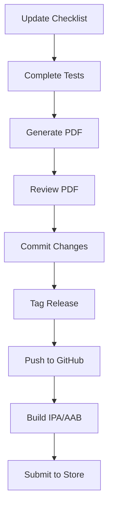

# Compliance System Quick Start Guide

© 2025 ZyraFlow Inc.™ All rights reserved.

---

## Overview

Flow iQ maintains compliance checklists for every release to ensure App Store guidelines, medical regulations, and privacy standards are met.

## Quick Commands

### Generate Compliance PDF for Current Release

```bash
./scripts/generate_compliance_pdf.sh
```

### Generate for Specific Version

```bash
./scripts/generate_compliance_pdf.sh 2.1.0
```

### View Current Compliance Status

```bash
open compliance/v2.0.3/compliance-checklist-v2.0.3.md
```

---

## Before Each Release

### 1. Update Checklist

Edit `FINAL_PRE_SUBMISSION_CHECKLIST.md`:
- [ ] Update version number
- [ ] Update date
- [ ] Complete all checklist items
- [ ] Document any known issues

### 2. Generate PDF

```bash
# Install dependencies (first time only)
brew install pandoc
brew install --cask wkhtmltopdf

# Generate PDF
./scripts/generate_compliance_pdf.sh
```

### 3. Review & Commit

```bash
# Review the PDF
open compliance/v2.0.3/Flow-iQ-Compliance-Checklist-v2.0.3.pdf

# Commit to git
git add compliance/
git commit -m "Add compliance checklist for v2.0.3"
```

### 4. Tag Release

```bash
git tag -a v2.0.3 -m "Release v2.0.3 - App Store submission"
git push origin v2.0.3
git push origin main
```

---

## Directory Structure

```
Flow-Ai/
├── FINAL_PRE_SUBMISSION_CHECKLIST.md    # Main checklist (edit this)
├── compliance/
│   ├── README.md                        # Compliance system docs
│   ├── v2.0.3/
│   │   ├── README.md                    # Version-specific info
│   │   ├── compliance-checklist-v2.0.3.md
│   │   └── Flow-iQ-Compliance-Checklist-v2.0.3.pdf
│   └── v2.1.0/                          # Future versions
└── scripts/
    └── generate_compliance_pdf.sh       # PDF generator
```

---

## Compliance Checklist Components

Each release checklist verifies:

### ✅ Technical (8 items)
- Release build
- No debug artifacts
- HTTPS enforcement
- SDK versions
- Code signing
- Info.plist configuration
- Firebase setup
- Bundle identifiers

### ✅ Privacy & Security (5 items)
- Privacy policy live
- HealthKit disclosure
- Data encryption
- Account deletion
- HIPAA compliance

### ✅ Content (5 items)
- App description plain text
- Medical disclaimer
- Non-diagnostic positioning
- Citation sources
- Age rating

### ✅ Testing (3 items)
- Demo account working
- All features tested
- Multi-device compatibility

---

## App Information Reference

### Current Release (v2.0.3)

**Build Details:**
- Version: 2.0.3
- Build: 1
- Bundle ID: com.flowai.health.flowAi
- Team ID: 9FY62NTL53
- Min iOS: 13.0+

**Demo Account:**
- Email: demo@flowiq.health
- Password: FlowIQ2024Demo!

**URLs:**
- Privacy Policy: https://ronospace.github.io/Flow-iQ/privacy-policy.html
- Repository: https://github.com/ronospace/Flow-iQ
- Support: https://github.com/ronospace/Flow-iQ/issues

---

## Release Workflow



1. **Update** - Edit FINAL_PRE_SUBMISSION_CHECKLIST.md
2. **Test** - Complete all manual testing
3. **Generate** - Run PDF generation script
4. **Review** - Verify PDF accuracy
5. **Commit** - Add to version control
6. **Tag** - Create git release tag
7. **Push** - Upload to repository
8. **Build** - Create release binaries
9. **Submit** - Upload to App Store/Play Store

---

## Troubleshooting

### PDF Generation Fails

**Error: pandoc not found**
```bash
brew install pandoc
```

**Error: wkhtmltopdf not found**
```bash
brew install --cask wkhtmltopdf
```

### Alternative PDF Generation

If you can't install pandoc:

1. **VS Code**: Install "Markdown PDF" extension
2. **Online**: https://www.markdowntopdf.com/
3. **macOS**: Open in Preview → Print → Save as PDF

### Checklist Not Updated

```bash
# Verify you edited the right file
cat FINAL_PRE_SUBMISSION_CHECKLIST.md | grep "Version:"

# Regenerate PDF
./scripts/generate_compliance_pdf.sh
```

---

## Best Practices

### ✅ DO:
- Update checklist before each release
- Complete all manual tests
- Review PDF before committing
- Keep all compliance docs in git
- Reference compliance in App Review notes
- Document known issues

### ❌ DON'T:
- Reuse old compliance PDFs
- Skip manual testing sections
- Commit PDFs without review
- Delete compliance history
- Submit without checklist reference

---

## Integration with App Store Submission

### Step 1: Prepare Compliance PDF

```bash
./scripts/generate_compliance_pdf.sh
open compliance/v2.0.3/Flow-iQ-Compliance-Checklist-v2.0.3.pdf
```

### Step 2: Reference in App Review Notes

Include in App Store Connect review notes:

```
Compliance Documentation:
- Full compliance checklist maintained in repository
- Version: 2.0.3
- All technical, privacy, and content requirements verified
- Manual testing completed
- Reference: compliance/v2.0.3/

Demo Account:
Email: demo@flowiq.health
Password: FlowIQ2024Demo!
```

### Step 3: Attach Supporting Documentation

- Upload compliance PDF as supporting documentation (if requested)
- Reference GitHub compliance folder URL
- Include in submission communications

---

## Contact

**Compliance Team:**
- Email: compliance@zyraflow.com
- Support: support@zyraflow.com

**Technical Questions:**
- GitHub Issues: https://github.com/ronospace/Flow-iQ/issues
- Documentation: https://github.com/ronospace/Flow-iQ/wiki

---

## Related Documentation

- **[Compliance System Overview](compliance/README.md)**
- **[App Store Metadata](docs/APP_STORE_METADATA.md)**
- **[Clinical Compliance Roadmap](docs/CLINICAL_COMPLIANCE_ROADMAP.md)**
- **[Screenshot Guide](docs/SCREENSHOT_GUIDE.md)**
- **[Release Summary](RELEASE_SUMMARY.md)**

---

## Version History

### v2.0.3 (Current)
- Initial compliance system implementation
- Automated PDF generation
- Comprehensive checklist coverage
- 70% submission readiness verified

### v2.1.0 (Planned)
- Enhanced wearable integration compliance
- Updated privacy disclosures
- AI transparency documentation
- Offline functionality verification

---

**Maintained by:** ZyraFlow Inc.™ Compliance Team  
**Last Updated:** November 1, 2025  
**© 2025 ZyraFlow Inc.™ All rights reserved.**
